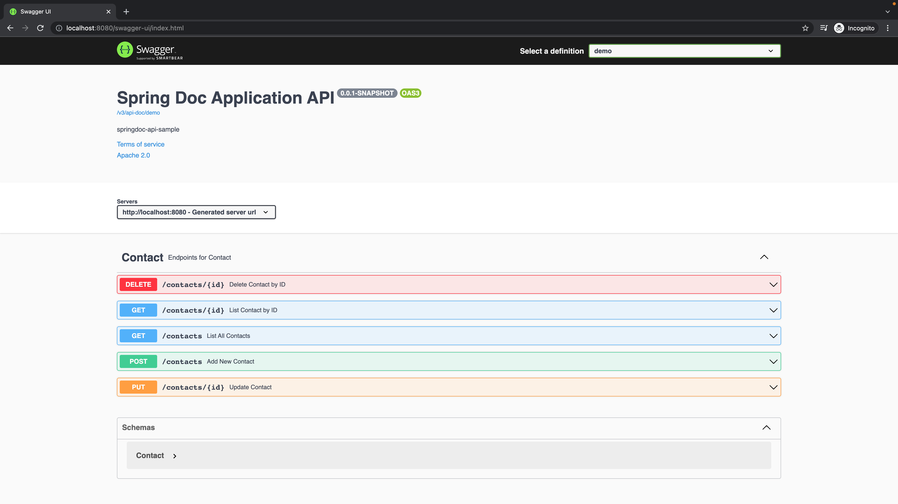

# springdoc-api-sample

### Things todo list

1. Clone this repository: `git clone https://github.com/hendisantika/springdoc-api-sample.git`
2. Navigate to the folder: `cd springdoc-api-sample`
3. Run the application: `mvn clean spring-boot:run`
4. Open your favorite browser: http://localhost:8080/sweagger-ui

Spring Doc Page

